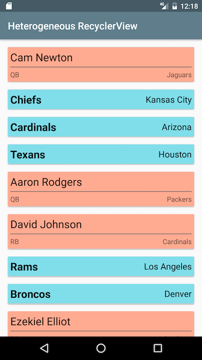

#  Heterogeneous RecyclerViews

> ***Note:*** _This can be a pair programming activity or done independently._

## Introduction

So far, it's likely that all your RecyclerViews have only contained one type of element.
In other words, every single entry in the list binds the same type of data object to the same views in the same xml layout.

That is sufficient in many cases, but we also have the option to make our lists more flexible by making them _heterogeneous_.
This means mixing different types of data & views in the same list.

For this assignment you will display NFL teams and players in the same list.
You will need to write a RecyclerView adapter that uses two different xml layouts for list entries, depending on whether each data object is a `Team` or a `Player`.

## Exercise

#### Requirements

- Complete the `FootballRecyclerViewAdapter` class
  - Your constructor should take in a single list of type `List<BaseFootballObject>` (not separate `List<Team>` and `List<Player>` lists)
  - See the hints in the starter code about how you can tell which xml file to inflate for each object in the list
- Set up your RecyclerView with an instance of your adapter in `MainActiity`
- If you want to start from scratch with different types of objects unrelated to the NFL, that's fine as long as you mix at least 2 different layouts into your RecyclerView

**Bonus:**
- Use a `LinearLayoutManager` if the user's device is in portrait orientation, and a `GridLayoutManager` for landscape
- Add additional classes that extend `BaseFootballObject`, write xml layouts for them, and add them into your list

#### Starter code

The [starter code](starter-code) contains a `model` package with classes for `Team` and `Player` which both extend a common parent class named `BaseFootballObject`.
There is a helper method in `MainActivity` that instantiates a bunch of `Team` and `Player` objects and adds them to a list of type `List<BaseFootballObject>`.

In the `res/layout` directory you'll find separate layouts for team and player: `team_list_entry.xml` and `player_list_entry.xml`.
There are also corresponding `ViewHolder` classes for both layouts.
Feel free to use these layouts & ViewHolders as is, or customize them if you'd like.

You are also free to start from scratch with a different premise that is not related to the NFL.
Just make sure you have at least two different types of data objects to display, and mix at least two different layouts into your RecyclerView.

#### Deliverable

You must submit a working app with multiple different layouts used in a RecyclerView. If you work with a partner, put both names in your pull request title.

Here's an example of how your app should look if you begin with the starter code:

---

## Licensing
1. All content is licensed under a CC­BY­NC­SA 4.0 license.
2. All software code is licensed under GNU GPLv3. For commercial use or alternative licensing, please contact [legal@ga.co](mailto:legal@ga.co).
